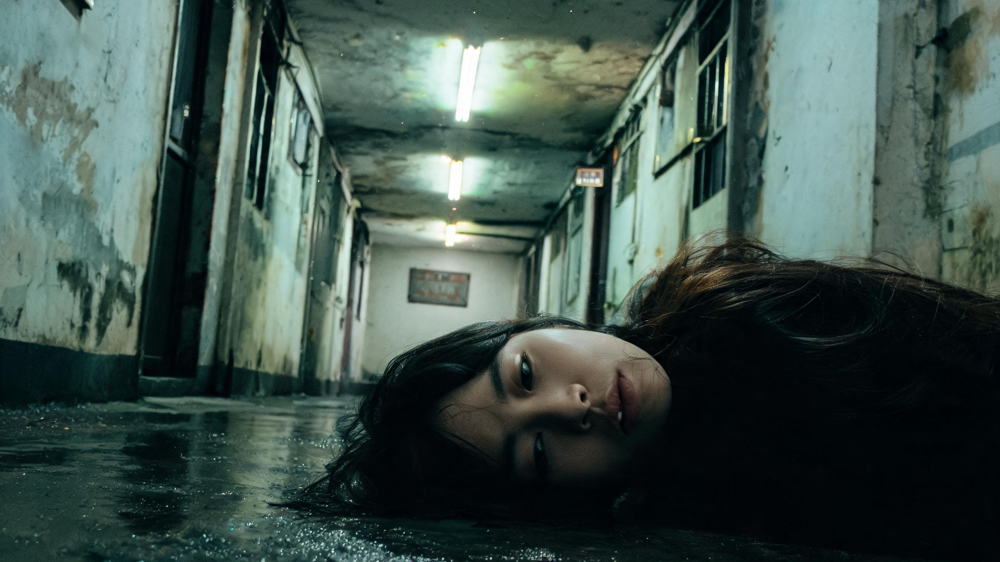

# 回廊 · The Corridor

> 一个规则怪谈「AI 互动影游」实验片。
> 你在永远走不出的老楼里醒来，墙上泛黄的《住户安全守则》是唯一的规则。

**这是一个由 AI 主导制作的实验作品。** 剧本、代码、图片、视频、乃至测试脚本，
绝大部分由 AI 生成，人类负责方向判断、审美拍板与素材提供。
完整分工见 [AI 制作声明](#ai-制作声明)。



---

## 这是什么

- **类型**：规则怪谈 · 互动影游 · 预制分支
- **时长**：单次通关 5–8 分钟，全部分支探索约 15 分钟
- **技术路线**：AI 生成视频 + 预渲染有限分支（当前唯一能跑通的 AI 影游做法）
- **性质**：创作实验，**不做商业设计**，只看作品本身

一句话定位：**遵守规则，还是违反规则——每一次选择都通向生或死。**

---

## 直接玩

**双击 `回廊/回廊_互动原型.html` 就行。**

这是一个 20.5MB 的自包含单页：所有图片、视频、音乐都以 base64 内嵌，
不需要联网、不需要装任何东西、不需要起服务器。用浏览器打开即可。

### 操作

| 操作 | 效果 |
|---|---|
| 点击「1」/「2」按钮 或 按数字键 | 做出选择 |
| 点击画面 或 按任意键 | 跳过打字机、跳过过场视频 |
| 右上角「守则」 | 随时翻看墙上的《住户安全守则》 |
| 右上角「声音」 | 静音 / 取消静音（两条音轨 + 音效一起管） |

### 规则

死亡不是惩罚。违反守则后角色会死，但你可以直接回溯到刚才的选择——
**试错本身就是这个题材的乐趣**。

真结局的那段视频**不可跳过**：必须看完，结局文字才会出现。

---

## 分支结构

```
S  醒来·回廊
│
├─ 节点1：走廊灯灭了，同时响起敲门声
│   ├─ 闭眼数到十（遵守守则1、2） → 存活 → 进入书房
│   └─ 打开门（违反守则2）        → 死亡 → 回溯到节点1
│
├─ 节点2：书房桌上有一张照片，照片上是你的脸
│   ├─ 不碰照片（遵守守则4）      → 拿到出口线索
│   └─ 拿起照片（违反守则4）      → 死亡 → 回溯到节点2
│
└─ 节点3：走廊尽头，电梯亮着；旁边是黑掉的楼梯间
    ├─ 走楼梯（相信守则5）        → 真结局 · 天台
    └─ 进电梯（守则3已被破坏）    → 循环结局 · 回到醒来
```

墙上的《住户安全守则》（可辨认的 5 条）：

1. 走廊的灯熄灭时，请闭上眼，默数到十。
2. 有人敲门时，先看猫眼——但在敲门声停止前，不要看。
3. 电梯里永远只有你一个人。若里面已有别人，请等下一趟。
4. 书房桌上的照片，若出现了你的脸，不要碰它。
5. 每层楼梯都应一模一样。若某层的门牌号重复了，立刻回头。

---

## 项目结构

```
AI互动影游/
├─ 回廊/
│  ├─ 回廊_创作设定.md          世界观 / 守则 / 分支树 / 分镜脚本
│  ├─ 回廊_互动原型.html        ★ 成品：自包含单页，双击即玩
│  ├─ 回廊_BGM选曲试听.html     BGM 选曲 A/B 对比页（附波形图与"波动指数"）
│  │
│  ├─ _build/                   ← 全部源码都在这里
│  │  ├─ template.html          【核心】游戏代码：剧情节点 + 引擎 + 样式
│  │  ├─ build.py               【核心】打包器：素材转 base64 内嵌 → 成品
│  │  ├─ gen_video.py           图生视频（智谱 cogvideox-flash / 阿里云百炼）
│  │  ├─ ark_video.py           图生视频（火山方舟版，已弃用，留作备份）
│  │  ├─ make_pan_video.py      超宽图 + crop 余弦平移 → 完全可控的摇镜
│  │  ├─ _verify.mjs            全流程验证（80+ 项断言，约 3 分钟）
│  │  ├─ _probe_ending.mjs      真结局单屏视觉探针（约 15 秒出图）
│  │  ├─ _probe_noskip.mjs      「视频不可跳过」行为验证
│  │  ├─ _make_audition.py      生成 BGM 试听页
│  │  └─ _verify_audition.mjs   试听页验证
│  │
│  ├─ 画面/                     6 张首帧图 + 4 段视频（成品素材）
│  └─ 音频/                     2 首成曲 + 4 首候选 + 波形图
│
└─ .workbuddy/memory/            AI 的工作记忆（见下）
```

**只有两个文件算"手写代码"**：`_build/template.html`（游戏本体）和 `_build/build.py`（打包器）。
其余都是素材与工具脚本。

### 怎么重新构建

```bash
cd 回廊/_build
python build.py
```

改内容只需要动 `template.html`，改完必须重跑 `build.py`，成品才会更新。

---

## AI 制作声明

**这个项目是一次「AI 能否独立做出一部互动影游」的实验，所以制作分工写清楚是有意义的。**

### 人类（李佳鸿）做了什么

- **定方向**：确定题材为规则怪谈，确定技术路线为「AI 视频 + 预制分支」
- **审美拍板**：多次否掉 AI 的方案并给出方向纠正。例如
  「这应该是晚上吧？」（改为深夜）、
  「我要的是模拟玩家来到天台，左右环顾城市，好像脱离了幻境的那种意味」（推翻静态眺望）
- **提供两件关键素材**：真结局视频、结尾曲
- **质量把关**：全程只看结果，不接受"能跑就行"

### AI 做了什么

- **剧本层**：世界观、5 条守则、3 节点分支树、4 镜分镜（`回廊_创作设定.md`）、全部台词与旁白文案
- **工程层**：整个网页互动原型的 HTML / CSS / JavaScript——分支引擎、打字机、
  三种视频机制（过场 / 叙事型结局 / 常驻循环背景）、两条音轨与音效系统、死亡回溯
- **视觉层**：出图提示词、首帧图生成、图生视频、ffmpeg 后处理
  （慢放、乒乓循环消接缝、抽帧量化运动幅度）
- **验证层**：自己写测试脚本、自己跑、自己查 bug。
  `_verify.mjs` 用 CDP 直驱 headless 浏览器跑 80+ 项断言，不依赖 Playwright

**一句话**：人是导演与甲方，AI 是编剧、摄影师、程序员和 QA。

### 开发中的关键踩坑（AI 自述）

留在这里，是因为它们比成品更能说明 AI 做片子真实的工作状态。

1. **角色一致性漂移**——独立生成的多张图，人物长相会变（定妆图短发，第一镜变长发）。
   这是 AI 影游最致命的穿帮。
2. **「闭包挂在 DOM 上」的幽灵 bug**——底图 `` 的 `onload` 用完不摘，
   导致切换节点时**上一个节点被重画一遍**。这类 bug 读代码看不出来，**必须真跑**。
3. **别让首帧演它已经处于的状态**——首帧图本身就是"睁眼"，提示词却写"缓缓睁开眼睛"，
   模型无法倒回去演，只能给出极微小的眼神游移。改用**整体性运镜**承载变化才成立。
4. **模型对"极缓慢"的响应是二值的**——要么大幅运动，要么完全静止。
   "极其轻微的缓慢位移"做不出来。实测用帧间差分量化：静止版 0.178，推镜版 2.795（差 15 倍）。
5. **`pointer-events: none` 管不住子元素**——隐藏的「重新走一遍」按钮，
   父层设了 `pointer-events:none`，但按钮自己写了 `auto`，于是**看不见却点得到**，
   视频没看完就能重玩。只有 `disabled` 属性拦得住。
6. **配图必须与文案咬合**——某死亡节点文案写"门外的走廊是空的"，
   却复用了"门外有双脚在逼近"的图，图文互相拆台。给新节点配图前得先读文案。
7. **测试自己也会写错**——多次出现"产品是好的，是断言写错了"。
   例如按 5 秒写断言，成品实际是慢放后的 22.3 秒。
   **失败的第一步是分清产品 bug 和测试 bug。**

---

## 素材来源与授权

**注意：这个仓库里的媒体素材授权状态不一致，再分发前请逐项确认。**

| 素材 | 来源 | 授权状态 |
|---|---|---|
| `回廊_BGM.mp3` | soundimage.org · Eric Matyas · *Welcome to the Mansion* | CC BY 4.0，**可商用但必须署名** |
| `音频/01~04*.mp3`（候选曲） | 同上 | CC BY 4.0，须署名 |
| `回廊_结尾曲.mp3` | **项目作者自备，来源与授权未核实** | **未知。请勿再分发** |
| `镜06_真结局_天台.mp4` | **项目作者自备**，豆包（Doubao）AI 生成，画面带 AI 水印 | **未知。请勿再分发** |
| `画面/` 中 6 张首帧图 | TapNow 创意工作室 AI 生成 | AI 生成内容 |
| 全部代码 | Anthropic Claude 生成 | 见下方「许可」 |

结尾曲与真结局视频这两件，是在"本地创作实验、不对外分发"的前提下使用的。
**本仓库的公开不代表这两件素材获得授权**——如果你要复制这个项目，
请把它们替换成你自己确认过授权的素材。

---

## 开发工具链

| 用途 | 工具 | 备注 |
|---|---|---|
| 剧本 / 代码 / 测试 | Anthropic Claude | 本项目全部工程与文案产出 |
| 首帧图生成 | TapNow 创意工作室 | AI 出图 |
| 图生视频 | 智谱 BigModel `cogvideox-flash` | 免费模型，支持本地图 base64 直传 |
| 图生视频（备选） | 阿里云百炼 `wan2.6-i2v-flash` | 开通送 90 天额度 |
| 视频后处理 | ffmpeg | 慢放、乒乓循环、抽帧量化、波形图 |
| 自动化验证 | Chrome DevTools Protocol | 直驱本机 headless 浏览器，免装 Playwright |
| 互动封装 | 原生 HTML / CSS / JS | 无框架、无依赖、单文件 |

### 关于 `.workbuddy/memory/`

这是 AI 的工作记忆目录——每日工作日志与长期项目备忘。
**把它一起放进仓库，是因为这个项目本身就是"AI 怎么做片子"的记录，
过程比成品更有意思。** 里面有决策依据、踩坑复盘、以及被人类否掉的方案。

它不参与程序运行，可以安全删除。

---

## 已知问题

- 真结局视频带**移动的「豆包AI生成」水印**，静态去水印方案无效，需要重新导出无水印版
- 真结局台词「风是凉的。天是亮的。」与画面实际的暮色/入夜**对不上**，待改
- 自包含单页 20.5MB，浏览器打开需约 3 秒解码，再加镜头会明显变慢
- 首帧图仅 6 张、视频 4 段，属于最小可玩验证，不是完整作品

---

## 许可

- **代码**（`回廊/_build/` 下全部脚本与模板）：MIT License，可自由使用、修改、分发
- **剧本与文案**（`回廊_创作设定.md`、游戏内文本）：CC BY-NC 4.0，署名 + 非商业
- **媒体素材**：授权状态见上方表格，其中标注「请勿再分发」的两项必须替换

---

*本项目为创作实验，不是商业产品。*
